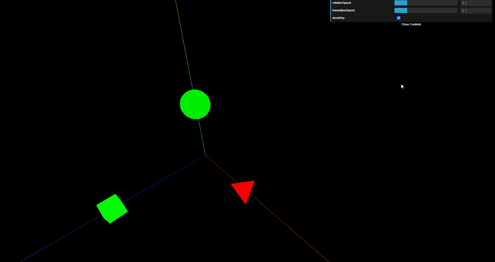
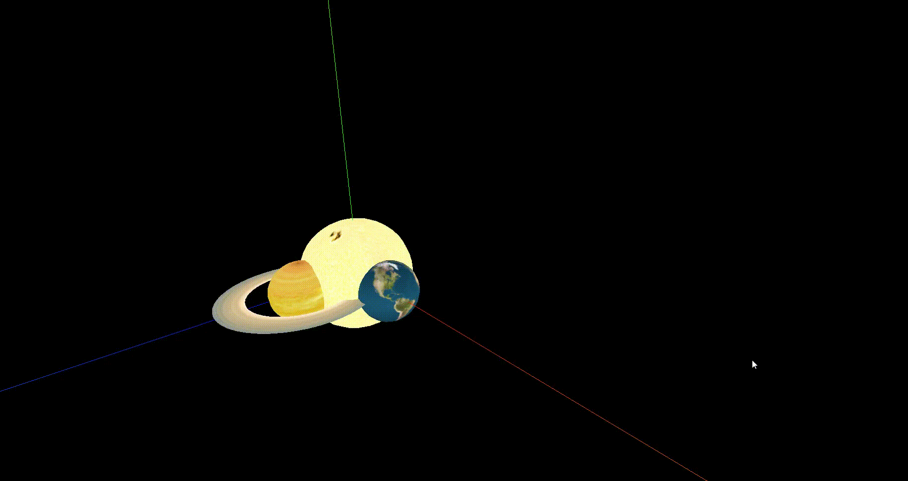
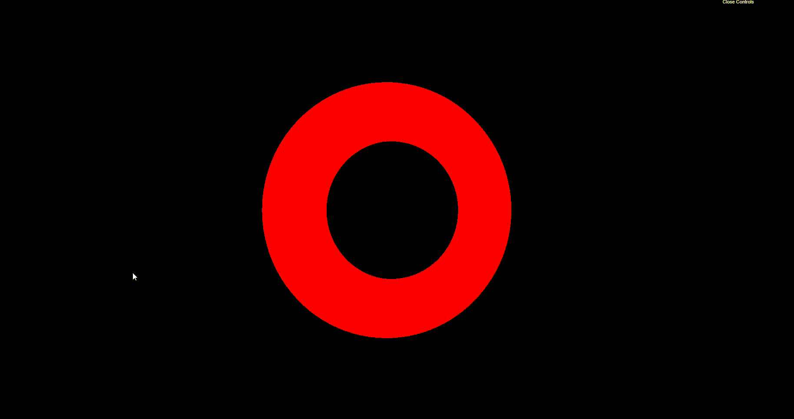

## 👁️‍🗨️ **Preview**

---

<div align="center">

Primeiro Exemplo

<details>
<summary>Clique para visualizar</summary>

</details>

---

Planetas

<details>
<summary>Clique para visualizar</summary>

</details>

---

Anel

<details open>
<summary>Clique para visualizar</summary>

</details>

</div>

---

Esfera

<details open>
<summary>Clique para visualizar</summary>

</details>

</div>

---

## ☂️ **Sobre**

Este projeto tem como intuito aprender sobre a biblioteca Threejs.

---

## 🛆 **Threejs**

JavaScript 3D library.

Three.js é uma biblioteca JavaScript/API cross-browser usada para criar e mostrar gráficos 3D animados em um navegador web. Three.js usa WebGL. O código-fonte é hospedado em um repositório no GitHub - [Threejs](https://github.com/mrdoob/three.js).

---

## 🧪 **Tecnologias**

Esse projeto foi desenvolvido com as seguintes tecnologias:

- [🛆 Threejs](https://threejs.org/)

---

## 🎮 **Ambiente de desenvolvimento**

- Se você usar apenas geometrias procedimentais e não carregar nenhuma textura, as páginas da web devem funcionar diretamente do sistema de arquivos, basta clicar duas vezes no arquivo HTML em um gerenciador de arquivos e ele deve aparecer funcionando no navegador (você verá o arquivo: file:///yourFile.html na barra de endereço).

- Se você carregar modelos ou texturas de arquivos externos, devido às restrições de segurança da política de origem dos navegadores , o carregamento de um sistema de arquivos falhará com uma exceção de segurança.

- Podemos resolver esta questão de algumas formas, você pode ver mais sobre isso em: [How to run things locally](https://threejs.org/docs/index.html#manual/en/introduction/How-to-run-things-locally).

- Optei por rodar um servidor local com: Node.js five-server.

```bash
node --version
v16.0.0

npm -g i five-server
```

---

## **🚀 Como executar**

- Clone o repositório.
- Para códigos com texturas, você precisa rodar um servidor local, veja mais em: [How to run things locally](https://threejs.org/docs/index.html#manual/en/introduction/How-to-run-things-locally).
- Inicie o servidor com `five-server . -p 8000`.

```bash
five-server . -p 8000
```

- O app estará disponível no seu browser pelo endereço [`localhost:5500`](http://localhost:5500).
- Para códigos sem texturas você pode abrir o arquivo index.html no seu navegador diretamente.

---

## ⚖️ **Licença**

Esse projeto está sob a licença MIT. Veja o arquivo [LICENSE](LICENSE.md) para mais detalhes.

---

Feito com 💜 by Rafael Angonese
